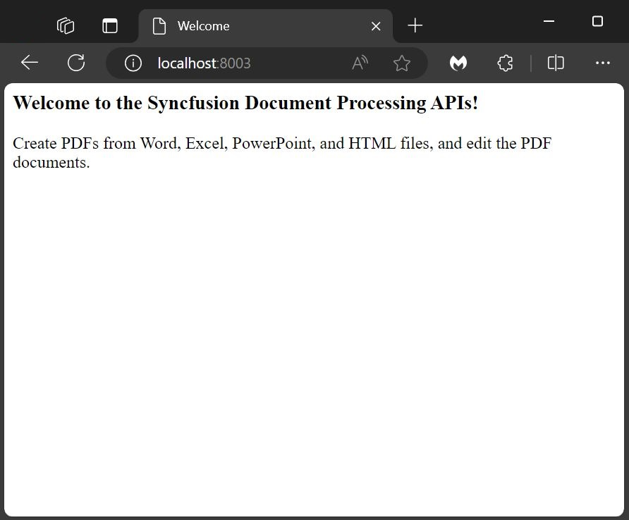

# Ready-to-Deploy Docker Image for Creating Document Processing Web APIs

The document processing API is a Web API used to create PDF documents from Word, Excel, PowerPoint, and HTML documents. It also has functionalities to edit the PDF document such as merge, split, flatten, compress, rotate, and delete PDF pages.

[Syncfusion Document Processing](https://www.syncfusion.com/document-processing-libraries?utm_source=docker&utm_medium=listing&utm_campaign=document-processing-libraries-docker) is a complete package of libraries that offers a rich set of APIs to create, edit, write, and convert PDF, Word, Excel, and PowerPoint files in web, desktop, and mobile applications without Microsoft Office or Adobe dependencies. 

This Docker image is the predefined Docker container of document processing APIs. You can deploy it quickly to your infrastructure.

If you want to add new functionality or customize any existing functionalities, then create your own Docker file by referencing the existing [document processing APIs project](https://github.com/Syncfusion/document-processing-apis).

- [Deployment Prerequisites](#deployment-prerequisites)
- [How to Use This Image](#how-to-use-this-image)
- [License](LICENSE)

## Deployment Prerequisites

### Hardware Requirements

The following hardware requirements are necessary to run the document processing API:

- **Operating System**: Use the document processing API Docker on the following operating systems:
  - Linux
  - Windows
  - MAC
- **CPU**: 2-core
- **Memory**: 8GB RAM
- **Disk Space**: 8GB or more

### Software Requirements

The following software requirements are necessary to run the document processing API:

- **Database**: PostgreSQL
- **Application**: [Docker](https://docs.docker.com/engine/) and [Docker Compose](https://docs.docker.com/compose/)
- **Web Browser**: Microsoft Edge, Mozilla Firefox, and Chrome

## How to Use This Image

**Step 1:** Pull the `document-processing-apis` image from Docker Hub.

```console
docker pull syncfusion/document-processing-apis
```

**Step 2:** Create the `docker-compose.yml` file with the following code in your file system.

> **Note:** The Document Processing API uses Syncfusion's Essential Studio and requires a valid license key for use in a production environment. To add your valid license key, set the `SYNCFUSION_LICENSE_KEY` environment variable in the `docker-compose.yml` file. To generate a valid license key, refer to this [Syncfusion Licensing FAQ](https://help.syncfusion.com/common/essential-studio/licensing/licensing-faq/where-can-i-get-a-license-key?utm_source=docker&utm_medium=listing&utm_campaign=document-processing-web-apis-docker). 
>
> If the license key is not applied, a watermark will be added to the generated PDF documents. The license key is version specific. If you are upgrading the Docker image, you need to update the license key to match the new version.

```yaml
networks:
  network:
    driver: bridge

services:
  syncfusion.api:
    container_name: document_processing
    image: syncfusion/document-processing-apis:latest 
    environment:
      - SYNCFUSION_LICENSE_KEY= {Your key here}     
      - ASPNETCORE_HTTP_PORTS=8080
      - PGHOST=database
      - PGUSER=postgres
      - PGPASSWORD=postgres
      - PGDATABASE=documentprocessing
      - PGPORT=5432
    depends_on:
      - database
    networks:
      - network
    volumes: 
      - ./storage:/FileData
      - ./fonts:/usr/local/share/fonts/
    ports:
      - "8003:8080"

  database:
    container_name: database
    image: postgres:latest
    environment:
      - POSTGRES_USER=postgres
      - POSTGRES_PASSWORD=postgres
      - POSTGRES_DB=documentprocessing
    volumes:
      - ./.containers/products-db:/var/lib/postgresql/data
    networks:
      - network
    ports:
      - "5432:5432"
```

**Step 3:** In a terminal tab, navigate to the directory where you’ve placed the docker-compose.yml file and execute the following.

```console
docker-compose up
```


The Document Processing APIs Docker instance is now running on localhost with the provided port number `http://localhost:8003/`. When you open this URL in your browser, you'll see the following message:



For further details, please refer to the [documentation link.](https://help.syncfusion.com/document-processing/web-apis/overview?utm_source=docker&utm_medium=listing&utm_campaign=document-processing-web-apis-docker)

